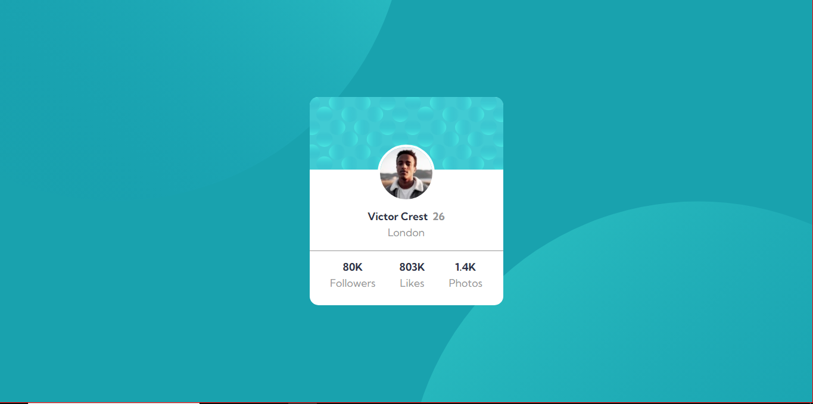

# Frontend Mentor - Profile card component solution

This is a solution to the [Profile card component challenge on Frontend Mentor](https://www.frontendmentor.io/challenges/profile-card-component-cfArpWshJ). Frontend Mentor challenges help you improve your coding skills by building realistic projects. 

## Table of contents

- [Overview](#overview)
  - [The challenge](#the-challenge)
  - [Screenshot](#screenshot)
  - [Links](#links)
- [My process](#my-process)
  - [Built with](#built-with)
  - [What I learned](#what-i-learned)
  - [Continued development](#continued-development)
- [Author](#author)
- [Acknowledgments](#acknowledgments)

## Overview

### The challenge

- Build out the project to the designs provided
### Screenshot

### Links

- Solution URL: (https://github.com/gabrieldev4/profile-card-component)
- Live Site URL: (https://gabrieldev4.github.io/profile-card-component/)

## My process

### Built with

- HTML5
- CSS custom properties
- Flexbox
- Mobile-first workflow

### What I learned

UI learned how to place two background images dividing half the height and half the width of the page. And I also reviewed the properties that center an item in the middle of the screen using justify-content and align-content, of course, depending on other configurations for it to occur correctly.

### Continued development

I intend to continue improving front-end development with HTML and CSS, but I also want to implement the knowledge I am acquiring from Bootstrap and JavaScript.

## Author

- Frontend Mentor - [@gabrieldev4](https://www.frontendmentor.io/profile/gabrieldev4)
- Instagram - [@eumoncayo](https://www.instagram.com/eumoncayo/)

## Acknowledgments

I appreciate the knowledge shared by Jamilton Damasceno in the web development course on Udemy.
